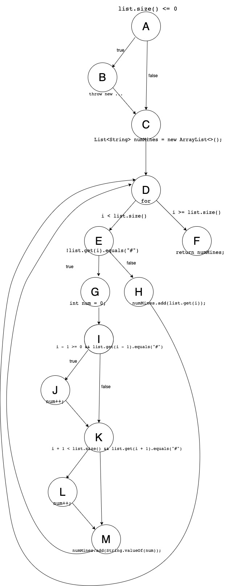

# Втора лабораториска вежба по Софтверско инженерство

## Клара Манасиева, бр. на индекс 171510

### Група на код: 

Ја добив групата на код 5

###  Control Flow Graph



### Цикломатска комплексност

Цикломатската комплексност на овој код е 6, истата ја добив преку формулата P+1, каде што P е бројот на предикатни јазли. Во случајoв P=5(A,D,E,I,K), па цикломатската комплексност изнесува 6.

### Тест случаи според критериумот  Every branch

```
@Test
public void EveryBranchTest() {

        assertEquals(List.of("#", "#", "#", "#", "#"), SILab2.function(createList("#", "#", "#", "#", "#")));
        assertEquals(List.of("#", "2", "#", "2", "#"), SILab2.function(createList("#", "0", "#", "0", "#")));

    }
```

### Тест случаи според критериумот Multiple conditions

```
@Test
public void multipleConditionsTest() {
        //H

        assertEquals(List.of("0","0","1","#"), SILab2.function(createList("0","0","0","#")));
        assertEquals(List.of("0","0","1","#"), SILab2.function(createList("0","0","0","#")));

        //J

        assertEquals(List.of("#","1","0","0"), SILab2.function(createList("#","0","0","0")));
        assertEquals(List.of("#","1","0","0"), SILab2.function(createList("#","0","0","0")));
    }
```

### Објаснување на напишаните unit tests

Every Branch се тестират сите ребра во графот на пример A-B, A-C, B-C, D-E, D-F, E-G, E-H, I-J, I-K, J-K, K-L, K-M, L-M
Multiple condtition значи се тестираат условите на if-statments.
Првата група тестови се однесува на
(i - 1 >= 0 && list.get(i - 1).equals("#"))
Втората група тестови се однесува на
(i + 1 < list.size() && list.get(i + 1).equals("#"))
